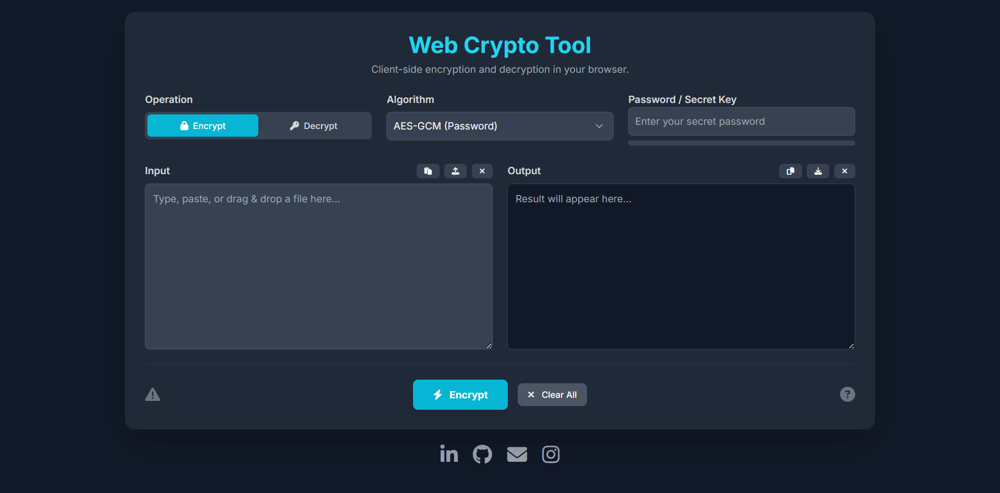

# **Web Crypto Tool**

A secure, client-side encryption and decryption tool that runs entirely in your browser. Encrypt text and files using AES-GCM or RSA-OAEP without your data ever leaving your computer.

### [**➡️ View Live Demo**](https://erpreetamk.github.io/crypto-tool/)

## **✨ Key Features**

* **Dual Encryption Algorithms**:  
  * **AES-GCM**: Symmetric encryption using a password. Fast, efficient, and ideal for large files.  
  * **RSA-OAEP**: Asymmetric encryption using a public/private key pair. Perfect for secure communication.  
* **Complete Client-Side Security**: All cryptographic operations are performed in your browser using the **Web Crypto API**. Your passwords, keys, and data are never sent to any server.  
* **Text & File Support**: Encrypt and decrypt both plain text messages and any type of file (images, documents, etc.).  
* **Full Key Management**:  
  * Generate secure 2048-bit RSA key pairs.  
  * Export and import keys in the standard JWK (JSON Web Key) format.  
* **User-Friendly Interface**:  
  * Clean, modern, and fully responsive design that works on desktop and mobile.  
  * **Drag-and-drop** support for file uploads.  
  * Real-time **password strength meter** to encourage secure passwords.  
  * Convenient copy, paste, download, and clear buttons.  
  * Helpful tooltips to explain algorithms and provide security warnings.

## **🛠️ Tech Stack**

* **HTML5**: For the core structure of the application.  
* **Tailwind CSS**: For a utility-first, responsive, and modern design.  
* **JavaScript (ES6+)**: For all application logic and interactivity.  
* **Web Crypto API**: The browser's native API for performing secure cryptographic operations.  
* **Font Awesome**: For clean and recognizable icons.

## **🚀 How to Use**

### **Encrypting with AES (Password)**

1. Ensure **Operation** is set to Encrypt.  
2. Select the **Algorithm** AES-GCM (Password).  
3. Enter a strong password in the **Password / Secret Key** field.  
4. Type your text in the **Input** box or upload a file.  
5. Click **Process**.  
6. The encrypted result will appear in the **Output** box. You can copy or download it.

### **Decrypting with AES (Password)**

1. Set **Operation** to Decrypt.  
2. Select the **Algorithm** AES-GCM (Password).  
3. Enter the **exact same password** used for encryption.  
4. Paste the encrypted text into the **Input** box or upload the encrypted file.  
5. Click **Process**.  
6. The original data will be restored in the **Output** box.

### **Encrypting with RSA (Key Pair)**

1. Ensure **Operation** is set to Encrypt.  
2. Select the **Algorithm** RSA-OAEP (Key Pair).  
3. If you don't have keys, click **Generate New RSA Keys**.  
4. Provide the **Public Key** of the recipient. You can paste it in or import it from a file.  
5. Enter your text or upload a small file in the **Input** box.  
6. Click **Process**.

### **Decrypting with RSA (Key Pair)**

1. Set **Operation** to Decrypt.  
2. Select the **Algorithm** RSA-OAEP (Key Pair).  
3. Provide your **Private Key** (keep this secret\!).  
4. Paste the encrypted text into the **Input** box or upload the encrypted file.  
5. Click **Process**.

## **🖥️ Running Locally**

This project is a single, self-contained HTML file. No build tools or dependencies are needed.

1. Clone this repository or download the index.html file.  
2. Open the index.html file in any modern web browser (like Chrome, Firefox, or Edge).  
3. That's it\! The application is fully functional offline.

## **👤 Author**

**Preetam Kumar**
* **Email**: er.preetamk@gmail.com  
* **GitHub**: [@erpreetamk](https://github.com/erpreetamk)  
* **LinkedIn**: [in/erpreetamk](https://www.linkedin.com/in/erpreetamk)
